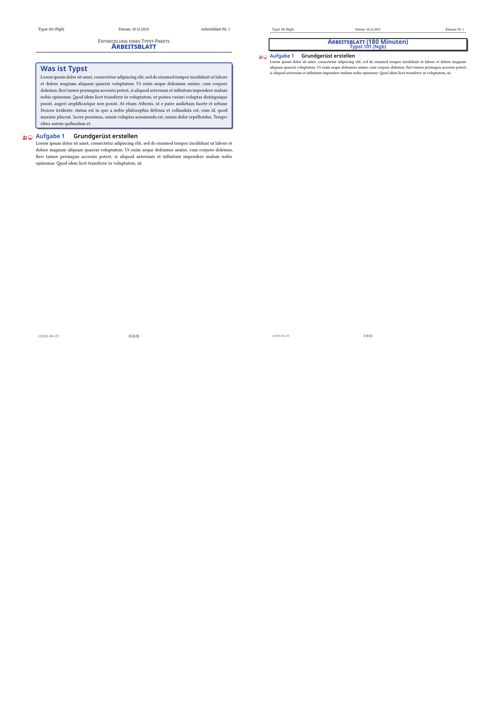

<h1 align="center">🏫 schule (v1.0.0)</h1>
<h4 align="center"><a href="https://typst.app">Typst</a> Vorlagen für den Einsatz in der Schule.</h4>

**Schule** ist eine Sammlung von Vorlagen und Modulen zur Erstellung von Arbeitsmaterialien für die Schule. Das Paket ist als Port des LaTeX Pakets [arbeitsblatt](https://github.com/jneug/arbeitsblatt) entstanden.
