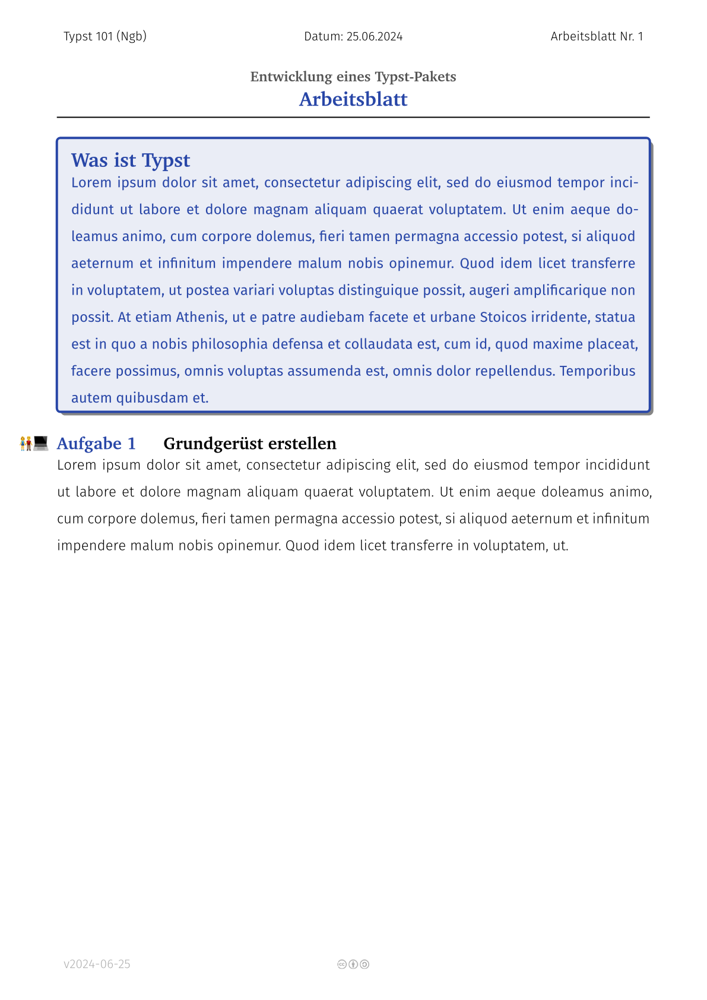

<h1 align="center">🏫 Schule (v1.0.0)</h1>
<h4 align="center"><a href="https://typst.app">Typst</a> Vorlagen für den Einsatz in der Schule.</h4>

**Schule** ist eine Sammlung von Vorlagen und Modulen zur Erstellung von Arbeitsmaterialien für die Schule. Das Paket ist als Port des LaTeX Pakets [arbeitsblatt](https://github.com/jneug/arbeitsblatt) entstanden.

## Changelog

### Unreleased

Full rewrite of the template with some breaking changes to the api.

### v0.2.0

- *Breaking*: Version 0.2.0 unterstützt nur noch Typst 0.11 und aufwärts.

#### Fixed
- Fehler beim erstellen der Schattenfarbe für Shwoyboxen behoben, wenn die Strichfarbe auf `auto` eingestellt war.
- `#container` hat nun als Standard abgerundete Ecken.

### v1.0.0

- Punkte im Erwartungshorizont von Klausuren lassen sich nun einzeln anzeigen: `#show: klausur.with(punkte-pro-erwartung: true)`
